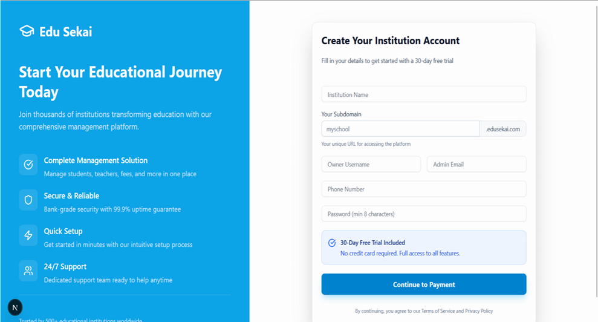
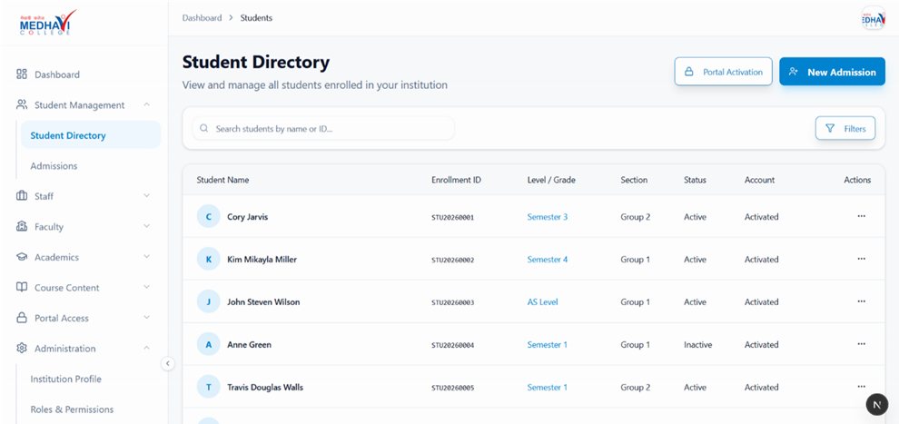

# EDU Sekai — Multi-Tenant School Management SaaS


EDU Sekai is a comprehensive SaaS platform for educational institutions, 
built using schema-based multi-tenancy to provide complete data isolation 
while maintaining a centralized identity and billing system.

> **Why I built this:** Managing multiple schools on a shared database 
> is a common but unsolved problem for EdTech startups in Nepal. 
> I wanted to design a system where each institution's data is physically 
> isolated at the database level — not just filtered by rows — 
> to guarantee security and enable true horizontal scaling.

---

## 📸 Screenshots

### Onboarding & Authentication

| SaaS Landing Page | Institution Registration |
|---|---|
|  |  |

| Tenant-Specific Login |
|---|
|  |

### Administrative Dashboard & LMS

| Student Directory | Study Materials |
|---|---|
|  |  |

### Role-Based Access Control

| Role Management | Permission Configuration |
|---|---|
|  |  |

---

## Architecture Overview

### Three Components

| Component | Tech | Purpose |
|---|---|---|
| Backend | Django REST Framework | API server, identity provider, tenant orchestrator |
| SaaS Frontend | Next.js | School onboarding, registration, eSewa payments |
| Tenant Dashboard | Next.js | Per-school LMS, student/staff management |

### Multi-Tenancy Strategy
Each school's data lives in a completely separate **PostgreSQL schema** 
(e.g., `school_oxford`, `school_cambridge`). This is stronger than 
row-level filtering — queries are physically scoped per tenant via 
`search_path` on every request.

### The Soft-Link Pattern
PostgreSQL Foreign Keys cannot span schemas. Instead of FK constraints, 
tenant profiles store `user_id` as a plain UUID referencing the public 
schema — maintained through Django signals, not database constraints. 
This enables horizontal sharding in future.

### Two-Tier Username System
- **Local username**: School-specific (e.g., `johnprasaddoe`) — unique per school
- **Global username**: System-wide (e.g., `johnprasaddoe_a1b2c3`) — unique platform-wide

---

## Security Highlights

- JWT tokens in HttpOnly cookies (XSS-protected)
- Granular RBAC on every endpoint
- Schema-level data isolation (no cross-tenant leakage possible)
- PBKDF2 password hashing
- All queries via Django ORM (no raw SQL / injection risk)

---

## Quick Start

```bash
# 1. Clone
git clone https://github.com/Rahul-1A44/Edu-Sekai
cd Edu-Sekai

# 2. Start backend
cd backend && docker compose up --build

# 3. Start SaaS frontend
cd frontend && npm install && npm run dev

# 4. Start tenant dashboard
cd tenant_frontend && npm install && npm run dev
```

Visit `http://localhost:3000` → register a school → 
access it at `http://yourschool.localhost:3555`

---

## Dev Utilities

```bash
# Generate test data for a school
docker compose exec backend python manage.py populate_test_data --schema=school_oxford

# Audit and fix broken UUID soft links
docker compose exec backend python manage.py audit_orphans --fix
```

---

nt
